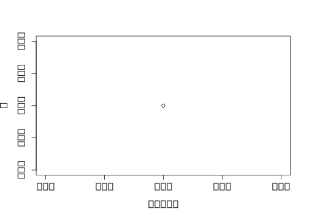

Cortexomics
================
Dermot Harnett
July 30, 2018

<!-- ## R Markdown -->

<!-- This is an R Markdown document. Markdown is a simple formatting syntax for authoring HTML, PDF, and MS Word documents. For more details on using R Markdown see <http://rmarkdown.rstudio.com>. -->

\#Figure
One

``` r
plot(1)
```


\#Figure
Two

``` r
include_graphics("tmp.pdf")
```

<embed src="tmp.pdf" title="caption" alt="caption" width="85%" type="application/pdf" />

\#Figure
Three

``` r
include_graphics("tmp.pdf")
```

<embed src="tmp.pdf" title="caption" alt="caption" width="85%" type="application/pdf" />

\#Figure
Four

``` r
include_graphics("tmp.pdf")
```

<embed src="tmp.pdf" title="caption" alt="caption" width="85%" type="application/pdf" />

<!-- ```{r cars} -->

<!-- summary(cars) -->

<!-- ``` -->

<!-- ## Including Plots -->

<!-- You can also embed plots, for example: -->

<!-- ```{r pressure, echo=FALSE} -->

<!-- plot(pressure) -->

<!-- ``` -->

<!-- Note that the `echo = FALSE` parameter was added to the code chunk to prevent printing of the R code that generated the plot. -->
